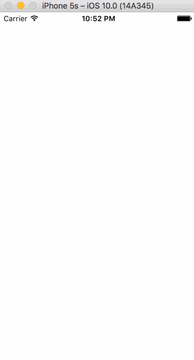

# Pre-work - Tipsy

Tipsy is a tip calculator application for iOS.

Submitted by: Tushar Humbe

Time spent: 17 hours spent in total

## User Stories

The following **required** functionality is complete:

* [x] User can enter a bill amount, choose a tip percentage, and see the tip and total values. 
* [x] Settings page to change the default tip percentage.

The following **additional** features are implemented:

- [x] Settings page to change the the theme
- [x] User can also enter the tip amount
- [x] User can chose number of people to split with
- [x] App remembers previous bill amount for 10 secs
- [x] Amount Text Box is the first responder and keyboard is visible when 
- [x] UI Animations: added expand spring effect on the tip percentage selector

## Video Walkthrough 

Here's a walkthrough of implemented user stories:

GIF created with [LiceCap](http://www.cockos.com/licecap/).

## Notes

Looks best on iPhone 5s in potrait mode.

Challenges:
Setting background image and clearing it took some time.

